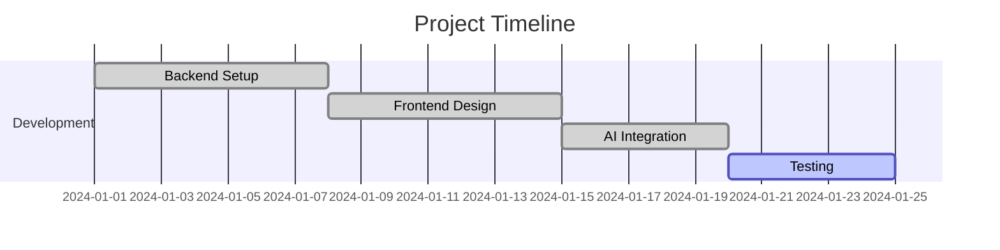
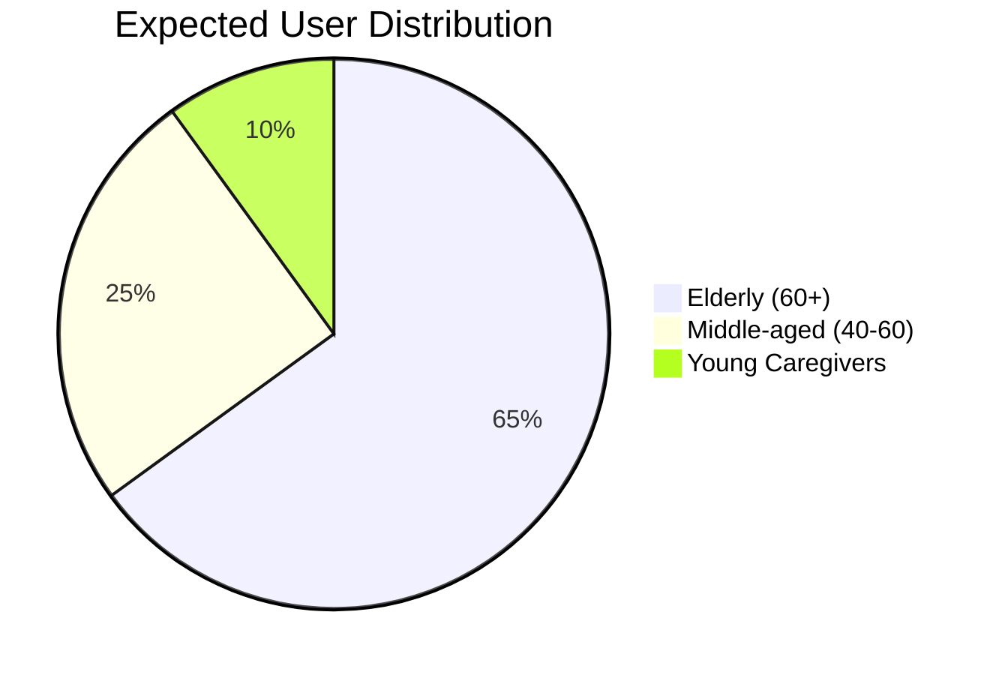

```markdown
# Digital Literacy Companion 🌐👵👴


*A Django-based web platform empowering elderly users to learn digital tools easily*

## 📊 Project Metrics


```



## ✨ Features

| Feature | Description | Tech Used |
|---------|-------------|-----------|
| 📺 Embedded Tutorials | Direct YouTube video integration for seamless learning | YouTube IFrame API |
| 🤖 AI Assistant | Gemini 1.5 Flash powered chatbot for digital queries | Google Generative AI |
| 🎙️ Voice Commands | Voice navigation support for accessibility | Web Speech API |
| 🌍 Multi-language | Support for multiple Indian languages | Django i18n |
| 🔍 Font Adjustment | Dynamic text sizing for better readability | CSS Variables |

## 🚀 Getting Started

### Prerequisites
- Python 3.8+
- Django 4.2
- Google Generative AI API key

### Installation
```bash
# Clone the repository
git clone https://github.com/yourusername/DLC_Website.git

# Navigate to project directory
cd DLC_Website

# Install dependencies
pip install -r requirements.txt

# Run migrations
python manage.py migrate

# Start development server
python manage.py runserver
```

## 📂 File Structure
```
DLC_Website/
├── dlc_website/         # Django project config
├── digital_literacy/    # Main app
│   ├── static/          # CSS/JS assets
│   ├── templates/       # HTML templates
│   ├── views.py         # Business logic
│   └── urls.py          # App routes
├── manage.py            # Django CLI
└── requirements.txt     # Dependencies
```

## 🌟 Key Components

### AI Chat Integration
```python
# Using Gemini 1.5 Flash
model = genai.GenerativeModel('gemini-1.5-flash')
response = model.generate_content(
    prompt,
    safety_settings={
        'HARM_CATEGORY_HARASSMENT': 'BLOCK_ONLY_HIGH'
    }
)
```

### Tutorials Embed
```html
<div class="video-container">
    <iframe src="https://youtu.be/sghayXZ_RK0" 
            allowfullscreen></iframe>
</div>
```

## 📈 Adoption Metrics



## 🤝 Contributing

1. Fork the Project
2. Create your Feature Branch (`git checkout -b feature/AmazingFeature`)
3. Commit your Changes (`git commit -m 'Add some AmazingFeature'`)
4. Push to the Branch (`git push origin feature/AmazingFeature`)
5. Open a Pull Request

## 📜 License
Distributed under the MIT License. See `LICENSE` for more information.

```
